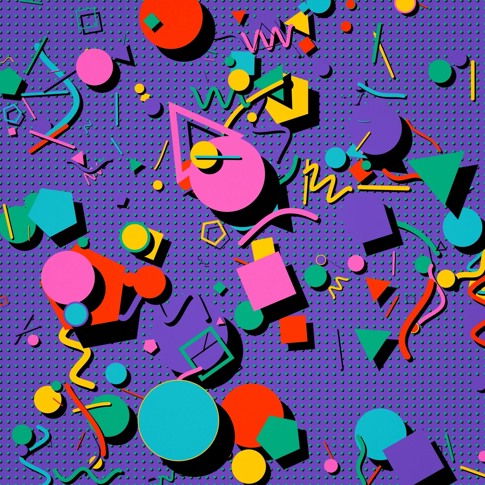
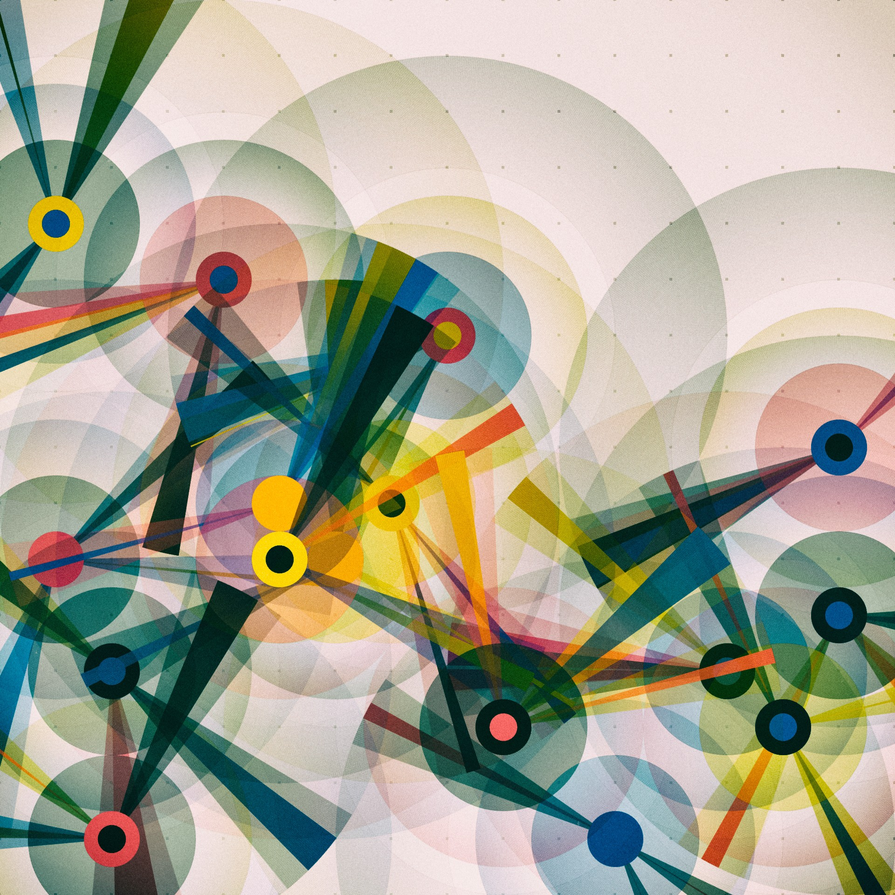

# IDEA9103-wyan0139-final
Perlin noise and randomness

                    {Overview

This project is an individual animated extension of our group’s generative reconstruction of Pacita Abad’s Wheels of Fortune.
The group produced a static procedural interpretation of the artwork using modular, class-based p5.js code.

My individual task was to animate the image using one of the four permitted methods:

Audio-based animation

Interaction-based animation

Perlin noise + randomness

Time-based animation

I chose Perlin noise + randomness to drive smooth motion across selected visual components.

This README describes how to interact with the work, the concepts behind my animation method, and a technical overview of how the code works.
}

                       {Keyboard Controls

Key	Function
R----Regenerate the scene with a new random seed
Shift + R----Regenerate using the same seed (reproducible layout)
S----Save a screenshot of the current frame
}

{Perlin Noise + Randomness

I chose this method because it allows the static composition to gain subtle, organic motion while preserving the textile-like quality of Abad’s original work. Perlin noise provides smooth, fabric-like undulations instead of jittery randomness.

I animated three main components:

Wheel Scaling
Wheels breathe in and out slowly using Perlin noise.
Scale variation is gentle and smooth (e.g., between ~0.3× and ~2× depending on seed).

Background Dot Drift
Dots in the negative space drift slightly in random directions, guided by noise fields.
Creates a floating, textile-like environment.

Scene-Level Movement
The entire canvas scrolls horizontally in a loop.
A second copy of the pattern is drawn beside the first to produce seamless cycling.
}

{
Generative Art & Noise-Driven Animation
Artists such as Jared Tarbell and Manolo Gamboa Naon inspired our approach to procedural repetition and smooth Perlin-noise variation. Their work demonstrated how organic patterns can emerge from simple mathematical rules. This led us to treat each wheel as an autonomous agent with noise-driven rotation and scale.

Web-based Motion Graphics
Contemporary web interaction pieces—such as “endless scroll” visual art showcased on Codepen—suggested presenting our composition as a horizontally looping animation. This concept aligns with Abad’s idea of cultural interconnectedness and movement.

}

{Technologies Outside the Course

Quadratic Bézier interpolation for bead arcs
Used to generate curved linking arcs.
Explained with inline comments in the code.

Scene tiling for infinite scrolling
Common in 2D game engines; implemented manually in p5.js.

}

{Infinite Horizontal Scrolling
const scroll = (timeSec * SCROLL_SPEED) % width;

translate(-scroll, 0);
drawScene(animTime);

translate(width, 0);
drawScene(animTime);
}

{Background Dot Drift
const dx = map(noise(d.nx, animTime * 0.2), 0, 1, -d.moveAmp, d.moveAmp);
const dy = map(noise(d.ny, animTime * 0.2), 0, 1, -d.moveAmp, d.moveAmp);
ellipse(d.x + dx, d.y + dy, d.r * 2);

Each dot contains its own pair of noise offsets, producing floating-like drifting behavior.
}